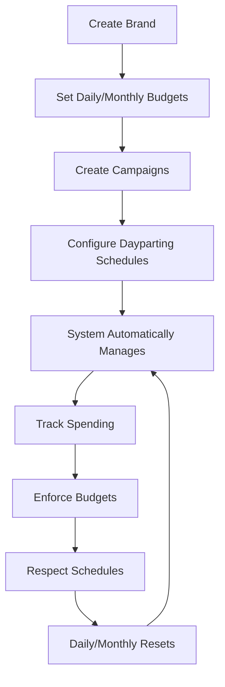
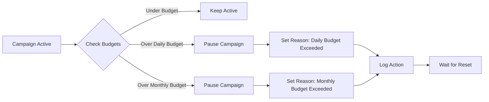
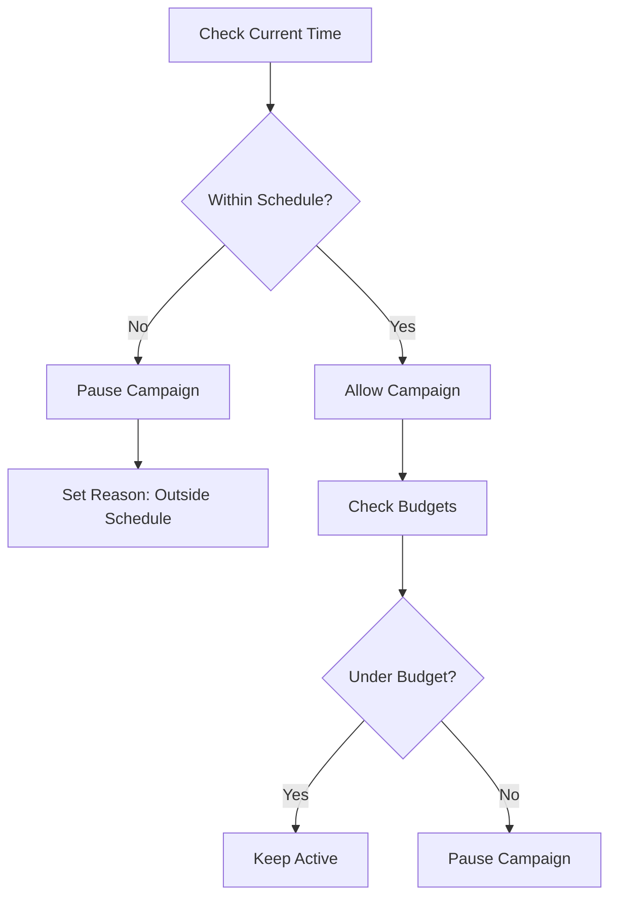
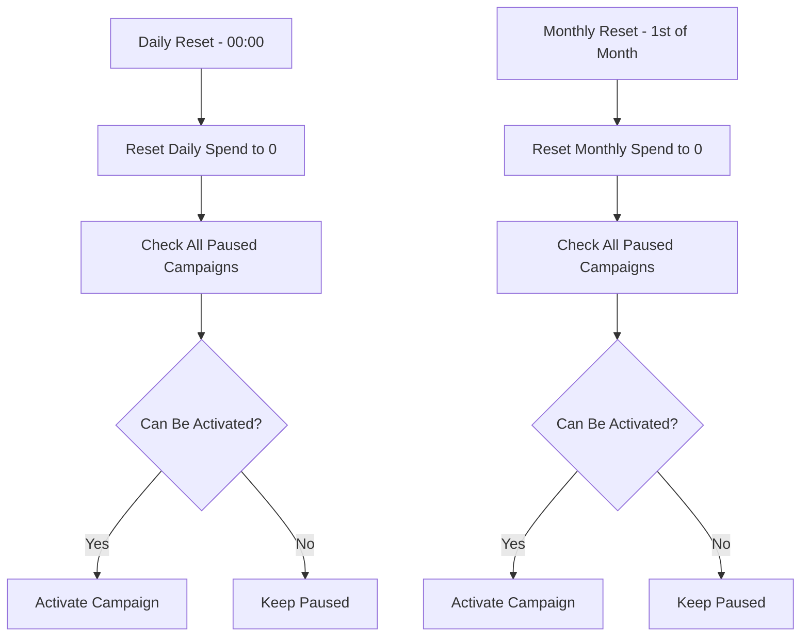

# Budget Management System - Usage Guide

## Overview

This guide walks you through setting up and using the Budget Management System to automatically control your advertising campaigns based on budgets and schedules.

## Quick Start

### 1. System Setup
```bash
# Start the system (includes all setup)
./run_all.sh
```

### 2. Access Admin Panel
- **URL**: http://localhost:8000/admin
- **Username**: `admin`
- **Password**: `admin123`

## Core Workflow



## Step-by-Step Setup

### Step 1: Create Your First Brand

1. Go to **Brands** in the admin panel
2. Click **"Add Brand"**
3. Fill in the details:
   - **Name**: "Acme Corporation"
   - **Daily Budget**: $100.00
   - **Monthly Budget**: $2000.00
4. Click **"Save"**

### Step 2: Create Campaigns

1. Go to **Campaigns** in the admin panel
2. Click **"Add Campaign"**
3. Fill in the details:
   - **Brand**: Select "Acme Corporation"
   - **Name**: "Summer Sale Campaign"
   - **Status**: Active
4. Click **"Save"**

**Note**: The system will automatically create a default 24/7 schedule for new campaigns.

### Step 3: Configure Dayparting (Optional)

1. Go to **Schedules** in the admin panel
2. Find your campaign's schedule
3. Click on it to edit
4. Configure:
   - **Day of Week**: Monday (0)
   - **Start Time**: 09:00:00
   - **End Time**: 18:00:00
   - **Is Active**: ✓
5. Click **"Save"**

**Repeat for other days as needed.**

### Step 4: Add Spending Records

1. Go to **Spends** in the admin panel
2. Click **"Add Spend"**
3. Fill in the details:
   - **Campaign**: Select your campaign
   - **Amount**: $25.00
   - **Spend Date**: Today's date
   - **Spend Type**: Daily
   - **Description**: "Facebook ad spend"
4. Click **"Save"**

## How the System Works

### Automatic Budget Enforcement

The system automatically monitors spending and pauses campaigns when they exceed budgets:



**Example Scenario:**
- Brand has $100 daily budget
- Campaign spends $25 → Still active
- Campaign spends another $80 → Total $105 → **Automatically paused**
- System logs: "Paused campaign due to daily budget limit"

### Dayparting Enforcement

The system respects campaign schedules and only allows campaigns to run during specified hours:



**Example Scenario:**
- Campaign scheduled for Monday 9 AM - 6 PM
- Current time: Monday 2 PM → **Campaign active**
- Current time: Monday 8 PM → **Campaign automatically paused**

### Daily and Monthly Resets

The system automatically resets spending and reactivates eligible campaigns:



**Example Scenario:**
- Campaign paused due to daily budget exceeded
- 00:00 next day → Daily spend reset to $0
- System checks: Under budget? ✓ Within schedule? ✓
- **Campaign automatically reactivated**

## Real-World Usage Examples

### Example 1: E-commerce Brand

**Setup:**
- **Brand**: "TechStore"
- **Daily Budget**: $500
- **Monthly Budget**: $10,000
- **Campaigns**: "Black Friday Sale", "Holiday Special"
- **Schedule**: Monday-Friday 8 AM - 8 PM

**Workflow:**
1. System tracks spending throughout the day
2. If spending reaches $500 → campaigns automatically paused
3. Next day at 00:00 → spending reset, campaigns reactivated
4. Outside business hours → campaigns automatically paused
5. During business hours → campaigns active (if under budget)

### Example 2: Local Restaurant

**Setup:**
- **Brand**: "Pizza Palace"
- **Daily Budget**: $50
- **Monthly Budget**: $1,000
- **Campaigns**: "Lunch Special", "Dinner Delivery"
- **Schedule**: Tuesday-Sunday 11 AM - 10 PM

**Workflow:**
1. Monday → All campaigns automatically paused (closed day)
2. Tuesday 11 AM → campaigns automatically activated
3. If daily spend reaches $50 → campaigns paused
4. Next day → reset and reactivate

## Monitoring and Management

### View System Status

1. **Campaign Status**: Check admin panel for active/paused campaigns
2. **Spending Overview**: View total spending by day/month
3. **Schedule Compliance**: See which campaigns are scheduled for current time
4. **Budget Alerts**: Monitor remaining budget vs. spending

### Manual Overrides

**Emergency Pause:**
1. Go to Campaigns in admin
2. Select campaign
3. Change status to "Paused"
4. Set reason to "Manual Pause"

**Emergency Activation:**
1. Go to Campaigns in admin
2. Select paused campaign
3. Change status to "Active"
4. Clear pause reason

**Budget Adjustment:**
1. Go to Brands in admin
2. Edit brand
3. Adjust daily/monthly budget
4. Save changes

## API Usage

### Track Spending Programmatically

```bash
# Add a spend record
curl -X POST http://localhost:8000/api/spends/ \
  -H 'Content-Type: application/json' \
  -d '{
    "campaign": "campaign-uuid",
    "amount": "25.50",
    "spend_date": "2024-06-26",
    "spend_type": "DAILY",
    "description": "Facebook ad spend"
  }'
```

### Get Campaign Status

```bash
# Check campaign status
curl -X GET http://localhost:8000/api/campaigns/campaign-uuid/
```

### Get Spending Summary

```bash
# Get spending statistics
curl -X GET http://localhost:8000/api/spends/
```

## Troubleshooting

### Common Issues

**Campaign Not Activating:**
1. Check if within scheduled hours
2. Verify budget limits
3. Check pause reason in admin panel

**Spending Not Tracking:**
1. Verify spend records are being created
2. Check campaign association
3. Review spend date and type

**Schedules Not Working:**
1. Verify schedule is active
2. Check day of week and time range
3. Ensure timezone is correct (system uses UTC)

### Debug Commands

```bash
# Check system health
python manage.py shell -c "from tasks.budget_tasks import health_check_task; print(health_check_task())"

# Manual budget enforcement
python manage.py enforce_budgets

# Manual dayparting enforcement
python manage.py enforce_dayparting

# Reset spending
python manage.py reset_spends --daily
python manage.py reset_spends --monthly
```

## Best Practices

### Budget Management
- Set realistic daily/monthly budgets
- Monitor spending regularly
- Use the admin panel to track trends
- Adjust budgets based on performance

### Schedule Management
- Create specific schedules for each campaign
- Consider time zones and business hours
- Test schedules before going live
- Use 24/7 schedules for always-on campaigns

### Spending Tracking
- Record spending promptly and accurately
- Use descriptive spend descriptions
- Categorize spending by type (daily/monthly)
- Review spending patterns regularly

### System Maintenance
- Monitor system logs for errors
- Check Celery worker status
- Verify database connections
- Keep system updated

## Automation Timeline

The system runs these automated tasks:

- **Every minute**: Dayparting enforcement
- **Every 5 minutes**: Budget enforcement
- **Daily at 00:00**: Reset daily spending
- **Monthly on 1st at 00:00**: Reset monthly spending

All times are in UTC.

## Next Steps

1. **Set up your first brand and campaign**
2. **Configure dayparting schedules**
3. **Start tracking spending**
4. **Monitor system automation**
5. **Adjust settings based on performance**

The system will handle the rest automatically! 🚀 